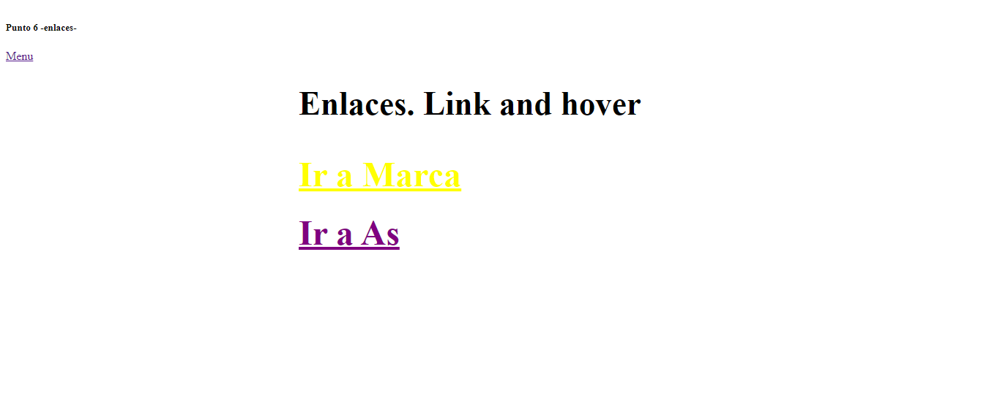

<h1>TALLER UNIDAD 9: Ana Maria Vargas</h1>

<h2>Información</h2>

curso full stack basico: grupo1

profesor: Cristian Patiño

<h2>punto 1: link figma</h2>
<a href="https://www.figma.com/file/BKx3pcayGzBUfRCqIzLR41/Ana-Maria-Vargas-G.-%2Fejercicios-Figma?type=design&node-id=0-1&t=UUPaUHX6mnayJJgq-0">link figma</a>

<a href="https://anamariavargas.github.io/taller-9-full-stack/">link WEB</a>

<h2>punto 2: HTML</h2>

<h2>Punto 3: css</h2>

<h2>Punto 4: TITULOS</h2>

<h2>Punto 5: ESTILOS</h2>

<h2>Punto 6: ENLACES</h2>

